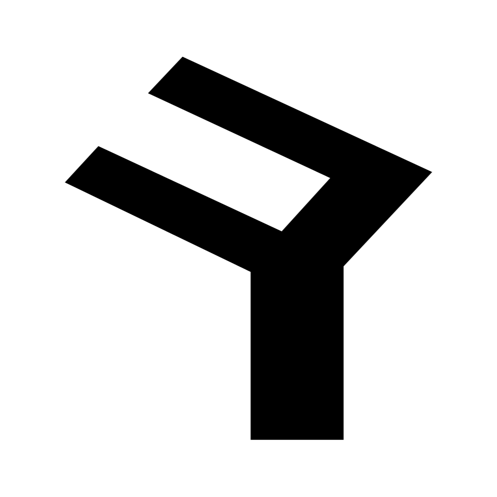
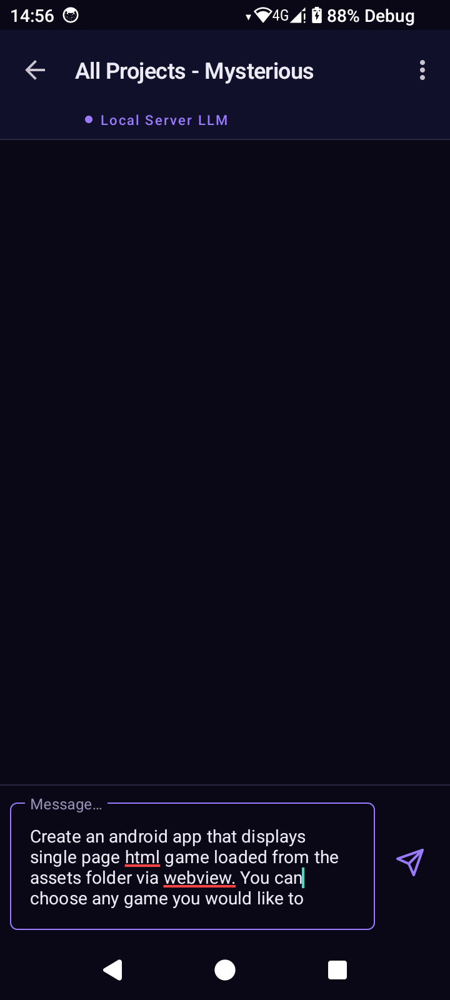
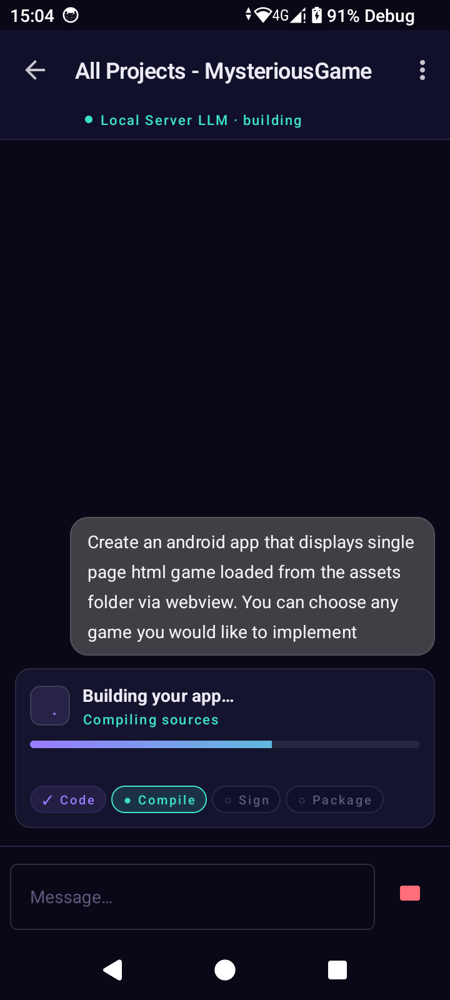
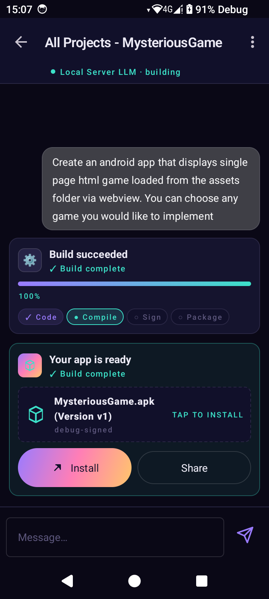
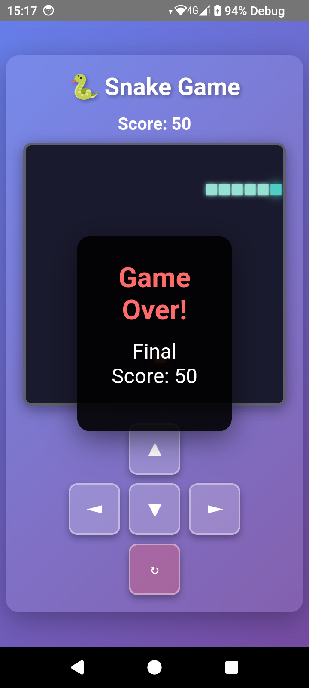
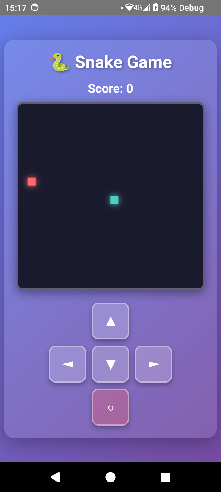
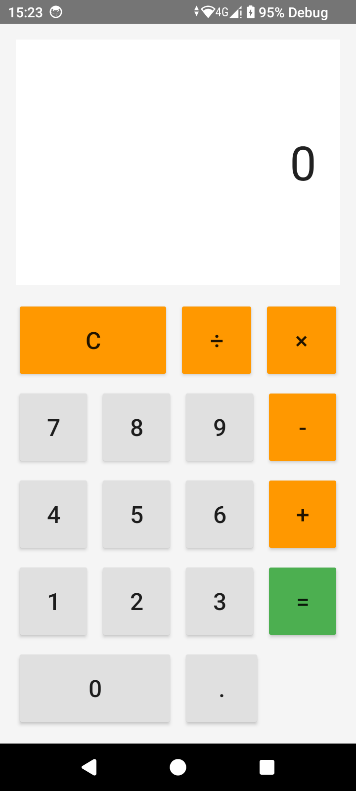
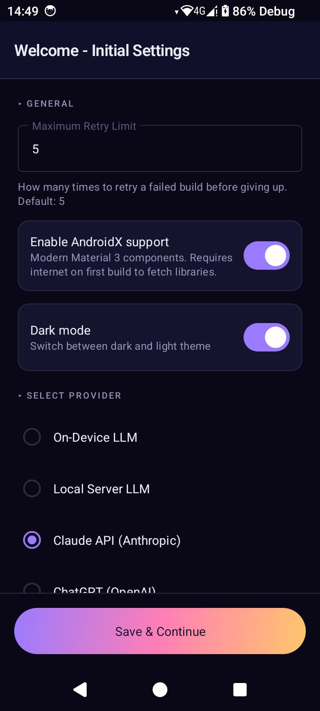
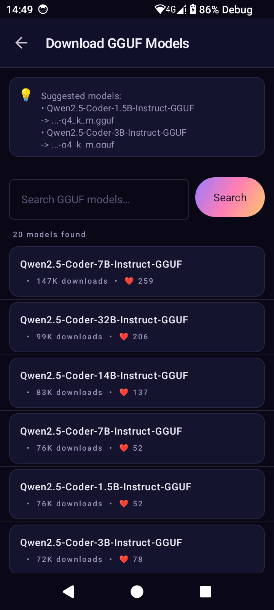
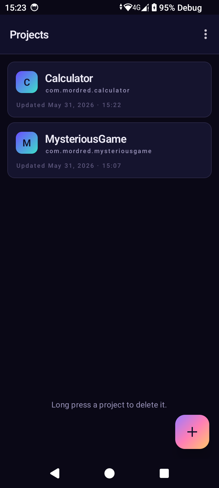

  

<h1 align="center">Salda</h1>

  <b>Describe an app. Get an APK. No laptop required.</b>

  Salda turns a single sentence into a fully compiled, signed, and installable Android app &mdash; entirely on your phone.

  

---

## Demo

https://github.com/user-attachments/assets/f24815cf-3605-4beb-bc60-8d52fb5943a4

> *Type a prompt, watch it build, install the result.*

---

## What Is This?

You type something like *"Write me a snake game"* or *"Make a calculator app"*. Salda sends your prompt to an LLM, takes the generated code, compiles it, packages it into a signed APK, and hands you an installable app &mdash; all without leaving your phone.

No Android Studio. No laptop. No server-side compilation. The entire build pipeline runs natively on the device.

---

## Screenshots

  
  &nbsp;
  
  &nbsp;
  

  <em>Describe your app &rarr; Watch it compile &rarr; Install the APK</em>

  
  &nbsp;
  
  &nbsp;
  

  <em>Generated apps: Snake Game &amp; Calculator &mdash; fully functional, running on the same device</em>

  
  &nbsp;
  
  &nbsp;
  

  <em>Provider settings &bull; Built-in HuggingFace model browser &bull; Project management</em>

---

## Features

- **One-prompt app creation** &mdash; describe what you want in plain English, get a working APK
- **Fully on-device compilation** &mdash; the complete build pipeline (compile, dex, package, sign) runs natively on your phone
- **Self-healing builds** &mdash; if a build fails, Salda feeds the errors back to the LLM and retries automatically (configurable, up to 5 attempts)
- **Runtime crash auto-fix** &mdash; if a generated app crashes, Salda captures the stack trace and can rebuild with a fix in one tap
- **Iterative refinement** &mdash; send follow-up prompts (*"add dark mode"*, *"make the buttons bigger"*) to modify your app without starting over
- **Works fully offline** &mdash; run a local LLM on your phone with no internet connection needed
- **Multiple AI providers** &mdash; use on-device models, a local server (Ollama), or cloud APIs (Claude, ChatGPT)
- **Built-in model browser** &mdash; search and download GGUF models from HuggingFace with resumable downloads
- **AndroidX & Material support** &mdash; generated apps can use modern Android components and themes
- **Encrypted API key storage** &mdash; credentials are protected with AES-256 encryption
- **Install or share** &mdash; install generated APKs directly on your device or share them with anyone

---

## Supported Providers

| Provider | Connection | API Key |
|---|---|---|
| **On-Device LLM** | Fully offline | Not needed |
| **Local Server (Ollama)** | Your local network | Not needed |
| **Claude API** | Cloud | Required |
| **ChatGPT API** | Cloud | Required |

For fully offline use, download a GGUF model through the built-in HuggingFace browser. Recommended: **Qwen2.5-Coder 1.5B&ndash;3B Instruct** for a good balance of speed and quality on mobile hardware.

---

## Getting Started

1. **Download** the latest APK from [GitHub Releases](https://github.com/sirmordred/Salda/releases/latest)
2. **Install** on your Android 11+ device (enable "Install from unknown sources" if prompted)
3. **Pick a provider** in the setup wizard &mdash; cloud API key, local Ollama server, or download an on-device model
4. **Create a project**, describe your app in one sentence, and hit send

---

## Requirements

| | |
|---|---|
| **Android** | 11 or newer (API 30+) |
| **CPU** | arm64-v8a or armeabi-v7a |
| **Storage** | ~50 MB free for builds; additional space for on-device models |
| **RAM** | 4 GB+ recommended for on-device LLM inference |

---

## License

Salda is released under the [Business Source License 1.1 (BUSL-1.1)](LICENSE).

---

  Built by <a href="https://github.com/sirmordred">Oguzhan Yigit</a>

